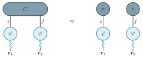
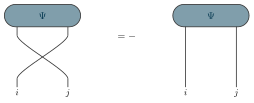
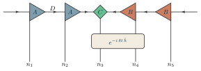
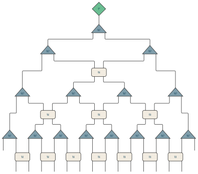

# tikz-tensors

One TikZ format for **tensor-network diagrams**, in one **shared theme** for
figures, notes and slides.

**Documentation:** <https://pen-sotashimozono.github.io/tikz-tensors/> — the
reference, and every example with its code beside its picture.

```latex
\usepackage{tikz-tensors}
```

| | |
|---|---|
|  |  |
|  |  |

## Shapes, not meanings

The package draws shapes and lines and places them; it never says what they
stand for.

| style | drawn as |
|---|---|
| `tn node` | the bare tensor: one stroke, no fill, 9 mm |
| `tn box`, `tn circle`, `tn capsule`, `tn rounded` | an outline, paper-filled |
| `tn triangle right`, `tn triangle left` | a triangle pointing that way |
| `tn triangle up`, `tn triangle down` | an isosceles triangle, as wide as the sites it spans |
| `tn diamond` | a diamond |
| `tn wide`, `tn tall`, `tn small`, `tn flat` | the same shape, resized |
| `tn fill=<colour>` | solid fill, outline in ink |
| `tn frame` | a dashed box around nodes |
| `tn edge`, `tn wavy`, `tn arrow`, `tn double` | an index: plain, wavy, with an arrowhead, two fused |
| `tn label` | the text on an index |
| `tn gate`, `tn env` | a gate, and the blocks at the ends of a stack |

What a shape *means* — that a circle on a wavy leg is a function of position, a
triangle an isometry, a diamond the orthogonality center — is a **notation**,
and a notation belongs to whoever draws in it. Keep yours as a file of styles
named for the meaning and built from the shapes, and `\input` it after the
package:

```latex
\tikzset{
  canl/.style = {tn triangle right, tn fill=canl},   % left-canonical
  cont/.style = {tn wavy, draw=ele},                 % a continuous argument
}
```

[`examples/conventions/notation.tex`](examples/conventions/notation.tex) is the
one the examples here are drawn in: `fn` a function of position on `cont` wavy
legs, `coef` an array, `op` an operator, `canl`/`canr`/`center` the canonical
form, `mpo`, `gate`, `disc` and `gauge`. It is an example of a notation, not
part of the package. A notation may also change the package's spacing, once
for all its figures: `\tnset{pitch=20mm, rise=14mm}`.

## Modules

The package is a set of modules in three folders of `tex/`, each module using
only what is loaded before it; `tikz-tensors.sty` loads them all.

| folder | module | defines | extended by |
|---|---|---|---|
| `core/` | `core` | the stroke, the edge layer, the tokens (`\tnset`), `tn node`, `tn edge`, `\tnbond` | — |
| | `canvas` | where a block goes: a row, `\tneq`, `\tnapprox`, `\tnbreak` | — |
| `style/` | `colors` | the theme's named colours (generated) | `theme/tokens.toml` |
| | `nodes` | **node types**: the shapes and sizes above, and what a layout reads off a type — `tn leg anchor` (where its index leaves), `tn points` (which way it points), `tn single` (one index on that side) | a style on `tn node` that sets those keys |
| | `edges` | **edge types** (`tn wavy`, `tn arrow`, `tn double`) and the routes an edge takes | a style on `tn edge` |
| | `labels` | `tn label`, `\tnput`, `\tnmid` | — |
| `layout/` | `layout` | **the abstract layout**: the record of a tensor, its ports and which are taken, and `\tnconnect`, `\tnopen`, `\tnopenswap`, `\tnjoin`, which hand their work to the layout of the block | a new layout |
| | `stack` | `\tnstack`, `\tnlayer`: sites across, layers down | — |
| | `tree` | `\tnstack[tree]`: a stack that keeps each tensor its own size and routes with corners | — |
| | `grid` | `\tngrid`: a square lattice turned by 45° | — |

A **layout** is a kind of block with a set of operations — connect, open a
block, open a tensor, join two ports, the port of a tensor in a column — and a
kind may inherit the ones it does not define from another: a tree is a stack
that sizes and routes its own way. `\tnconnect`, `\tnopen` and `\tnjoin` are
the same commands on every layout and ask the block's layout what to do, so a
new layout is one file in `layout/` and nothing else changes.

A tensor's indices are **ports**, and the contraction rules work on nothing
else: a layout records where each tensor is, its type says where an index
leaves it, and every index — implied by the layout, open, or joined by hand —
runs from a port. Each port is drawn once: joining or opening one that is
drawn already is an error, and opening a whole block skips the ports that are
taken. So a chain, a tree and a MERA are not cases the package knows; they are
tensors on a layout, contracted by one set of rules.

A figure of an algorithm is drawn on a **stack**: n sites across and named
layers down, at one pitch the package owns, with a block (the rest of the
network, contracted) at either end. Nothing in it is a length or a coordinate:

```latex
\tnstack[left=$L$, right=$R$]{H}{2}{ket, op, bra}   % examples/14-heff-two-site.tex
\tnlayer{H}{op}{2*mpo/$W$}
\tnconnect{H}
\tnopen{up}{H-op-1, H-op-2}
```

`\tnlayer` takes one entry per slot:

| entry | is |
|---|---|
| `<style>/<label>` | a tensor in the slot |
| `<style>/<label>/<span>` | one tensor across `<span>` sites |
| `<style>/<label>/<span>/<down>` | … and down `<down>` layers, with an index into each |
| `.` | an empty slot |
| `-` | the layer's index runs through |
| `\|` | the site's index runs through (a gate's layer, room for a crossing) |
| `dots` | the dots of a chain that goes on |
| `<n>*<entry>` | the entry `<n>` times: `4*canl/$A$`, `7*.` |

A style with a comma, or a label with a slash, goes in braces:
`{coef, circle}/$A$`, `gate/{$U(\delta t/2)$}/2`. A run of like entries is
always written as one `<n>*<entry>` — the linter holds figures to it, so a
layer has one spelling.

- `\tnconnect[along=…, down=…, apart={…}]` draws every index the grid implies;
  a bond with an arrow takes its direction from the triangles it joins, so a
  canonical form's arrows all point at the center without being written.
- `\tnopen[edge=…, label=…]{<up|down|left|right>}{<tensor or stack>, …}`
  opens indices; given a stack, every site (or layer) at once.
  `label=$\sigma_{#1}$` labels each end, `#1` its number;
  `labels={$n_1$, $n_N$}` gives them one by one. `\tnopenswap` opens two crossed (an
  exchange of fermion legs; the sign goes in the equation, as in example 02).
- `\tnjoin{<tensor>:<side>}{<tensor>:<side>}` joins two ports the lattice
  does not: the bond that closes a periodic chain, a trace, a bond that skips
  its neighbours. Two ports facing each other with nothing between are joined
  straight; any other index runs along the gutters between columns and
  layers, so it never passes through a tensor (example 07).
- `\tngrid[bonds=…]{P}{4}{4}{coef/$A$}` places a two-dimensional network of
  one tensor, turned 45°; `\tnconnect{P}` draws its bonds and
  `\tnopen{down}{P}` its physical indices, straight down.
- `\tnstack[close={g2, g3}]` sets those layers closer under the one above —
  the layers of a circuit of gates; how close is the token `closerise`, set
  once in a notation (`\tnset`).
- `\tneq[factor=$\lambda$]`, `\tnapprox` write a relation and the next stack goes after
  it; a stack after a stack stands beside it; `\tnbreak` starts a row below.
- A triangle's physical index leaves from the corner of its flat side
  (`tn leg anchor`), and the triangle is set across so that corner is on the
  site's line.
- Two tensors one above the other meet on every site they both cover if they
  cover the same ones, and otherwise once, in the middle of the sites they
  share — which is what places the branches of a tree (`tn triangle up`,
  `tn single`) and the layers of a MERA. `\tnstack[tree]` keeps every tensor
  its own size and routes those indices with corners, as trees are usually
  drawn.

Every example is drawn this way, and `tests/lint.py` holds them to it
(`docs/roadmap.md`). Every optional argument is `key=value`, and
[`docs/reference/`](docs/reference/index.md) lists the whole interface — how
a figure is put together, every command and key, every style with what it is
built on and a picture, and every name a figure can refer to — and is checked
against the code.

Labels are ordinary LaTeX math, so a diagram uses exactly the glyphs of the
equations beside it; `pdftocairo -svg` turns them into paths, so the SVG shows
the same everywhere without the fonts installed.

## The theme

`theme/tokens.toml` is the only place a colour is defined: the GitHub-style
palette of the page (light and dark) and the **physics colours**, which carry
meaning in every medium — `ele` electrons and position legs, `nuc` nuclei,
`coef` arrays, `exchange` the exchange term / hole / sign, `exact` reference
results.

```sh
python3 scripts/theme.py           # writes tex/style/tikz-tensors-colors.tex and theme/theme.css
python3 scripts/theme.py --check   # fails if either is out of date
```

Standard library only (Python 3.11+). `theme/theme.css` defines every token as
a CSS custom property (`--fg`, `--accent`, `--ele`, …; dark under
`prefers-color-scheme` and `[data-theme="dark"]`), for HTML notes and
storyboards; the TeX file defines `tt<name>` for the page tokens and the
physics colours by name for diagrams.

## Use in a project

Put `tex/` on TeX's search path — for example
`TEXINPUTS=/path/to/tikz-tensors/tex//:` (the `//` searches its folders) —
or copy every file under `tex/`, flattened, next to your
figures. A figure page is a `standalone` document:

```latex
\documentclass[border=4pt]{standalone}
\usepackage{amsmath}
\usepackage{tikz-tensors}
\input{notation}   % your own: the styles named for what they mean
\begin{document}
\begin{tikzpicture}
  \tnstack{P}{4}{ket}
  \tnlayer{P}{ket}{2*canl/$A$, 2*canr/$B$}
  \tnconnect[along=gauge]{P}
  \tnopen{down}{P}
\end{tikzpicture}
\end{document}
```

`python3 scripts/pages.py` builds the documentation site into `_site/`
(gitignored) from `docs/reference/`, `examples/` and the reference pictures. As
Julia's Documenter does, the workflows publish it to the `gh-pages` branch
(`scripts/publish.py`): `Documenter.yml` puts every release from `main` at
`v<version>/` and `stable/`, which the site root redirects to, and a switcher
in each page's header moves between them; `DocumenterPreview.yml` publishes a
pull request's site at `previews/PR<n>/`, links it in the pull request, and
removes it when the pull request closes. Pages serves the `gh-pages` branch. An example's first line is its title
on the site, `%% <title>`, and the comment under it its description.

With `python3 scripts/engine.py` run first, the site also draws figures in
the reader's browser: TikZJax, TeX compiled to WebAssembly (pinned by version
and SHA-512, GPL-3.0-or-later, served unmodified), is copied to `live/` with
the package's files beside it. Every example then has *Edit live* — its code
becomes editable and the figure is drawn again on the page as one types — and
`live.html` is a playground. Nothing needs to be installed to try the
package; the pictures the tests check are still LuaLaTeX's.

`scripts/build-examples.sh` builds `examples/*.tex` into `examples/out/`
(SVG and PDF, gitignored) with LuaLaTeX and `pdftocairo`; the pictures in this
README are the test references, which are the same SVGs.

## Where the real tikz-tensors is

**`main` of this repository is the one canonical tikz-tensors, and it is
always a release**: its `tex/` and `theme/` are exactly the newest tag. Every
other copy is a pointer or a proposal.

A project uses it as a **git submodule** pinned at a release, and develops it
there, in place, while its own figures rebuild against the edit:

```text
project/.github/tools/figures/tikz-tensors   (submodule)
  pinned at v0.2.0                      -> the project builds with a release
  on branch <project>/<topic>, pushed   -> a proposal from that project; the
                                           project may build with it for a while
  PR to main, merged                    -> released as the next version; every
                                           project moves to it when it chooses
```

Name a development branch after the project it comes from
(`review-hfdmrg/fn-size`), so a branch says where it was born. Whether a
proposal goes to `main` is decided separately, as a PR here; until then it is
not tikz-tensors, only that project's variant of it.

Gates that keep this true:

- **`main` takes only pull requests** (ruleset: no direct push, no force push,
  no deletion, admins included), each with `version`, `theme` and `test`
  passing on a branch up to date with `main`.
- **The version check** (below) makes every change to the package a new
  version, so a merge to `main` is a release.
- **After each merge** the Release workflow tags and releases that version and
  confirms `main`'s package is exactly that tag (`version.py released`).
- A project's own CI can then tell a pinned release from a proposal, and a
  pushed commit from one that exists only on somebody's machine.

## Versions

[Semantic versioning](https://semver.org), on what a document can refer to:
the style names, the commands, the colour names and the theme tokens. The
version lives only in the `\ProvidesPackage` line of `tex/tikz-tensors.sty`
(so a document's `.log` shows it); `CHANGELOG.md` has one section per version.

| step | when |
|---|---|
| **major** | a name is removed or renamed, or changes meaning (`cont` no longer a continuous argument) |
| **minor** | a name is added, or a picture in `tests/reference/` changes — existing figures still compile but look different |
| **patch** | anything else under `tex/` or `theme/`: a fix that leaves every picture as it was |

Before 1.0.0 a removal is a minor step, as semver allows for 0.x (v0.2.0
removed the schematic parts). A change outside `tex/` and `theme/` (tests,
docs, CI) does not move the version.

```sh
python3 scripts/version.py                     # the current version
python3 scripts/version.py bump minor "Why."   # move it one step; opens the CHANGELOG entry
python3 scripts/version.py check --base origin/main
python3 scripts/version.py released origin/main   # main's package is exactly its release
```

CI runs `check` on every pull request: it reads which names appeared or
disappeared and which reference pictures changed, and fails unless the version
moved by exactly one step, at least as large as the change needs, with a
CHANGELOG section filled in. Merging a new version to `main` tags it
`v<version>` and publishes a release with `tikz-tensors-v<version>.zip`.

## Tests

```sh
tests/run.sh                   # all of it: LuaLaTeX, pdfLaTeX, the rules, the pictures
tests/run.sh --update          # accept a deliberate change in appearance
tests/run.sh compile lualatex  # one step: compile | rules | compare
```

Every file in `examples/` and `tests/cases/` must compile with both engines
without a warning, every style and command must be drawn by one of them
(`tests/coverage.py`), and every example must follow the figure rules
(`tests/lint.py`). The LuaLaTeX pages are then turned into SVG by `pdftocairo`
and compared with `tests/reference/*.svg` as drawings (`tests/compare.py`,
standard library only): path by path and glyph by glyph, numbers within a
quarter of a point. A moved leg, a changed colour or a lost label fails, and a
`-diff.txt` lists what differs. In CI each of those is its own job, the comparison in the one named
`test`, and the rendered pages are the `rendered` artifact of the run.
`tests/cases/styles.tex` shows every style side by side — a new style is
added there.

## Acknowledgements and related work

The graphical notation is the field's common one — tensors as shapes, indices
as lines, triangles for isometries — and
[tensornetwork.org](https://tensornetwork.org/) is where much of
it is laid out; the algorithms the examples draw are the ones it reviews. Two
examples take their layout from the figures on its front page:
[`19-ttn`](examples/19-ttn.tex) (the tree tensor network) and
[`20-mera`](examples/20-mera.tex) (the MERA). Their drawings are this
package's own; the arrangement is theirs, and each file says so.

Other tools for tensor-network diagrams:

- [tikz-tensor-networks](https://ctan.org/pkg/tikz-tensor-networks)
  ([tenkz](https://github.com/LionSR/tenkz)) — a TikZ package on CTAN that
  draws a diagram from a description of the network: MPS, PEPS, string and
  channel diagrams. More general than this one; this one fixes every length
  and lints figures so that one network has one spelling.
- [mptikz](https://github.com/arolandi97/mptikz) — TikZ functions for
  one-dimensional networks, MPS and MPO.
- [TensorTrace](https://www.tensortrace.com/) — an application for drawing
  networks and generating the code that contracts them.

## Licence

MIT.
