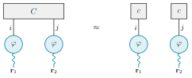
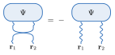
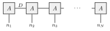

# tikz-tensors

One TikZ format for **tensor-network diagrams**, in one **shared theme** for
figures, notes and slides.

```latex
\usepackage{tikz-tensors}
```

| | |
|---|---|
|  |  |
|  | |

## The notation

What a **leg** carries:

| style | drawn as | means |
|---|---|---|
| `cont` | wavy, electron colour | a continuous argument (**r**, **r**₁, x) |
| `disc` | plain line | a finite index (i, μ, a bond) |

What a **node** is:

| style | drawn as | means |
|---|---|---|
| `fn`, `fnwide`, `fntall` | circle / rounded box, electron colour | a function of position (ψ, φ) |
| `coef`, `coefwide`, `coeftall` | square / box, grey | an array of numbers (C, c, A) |
| `op`, `opwide` | square-cornered box, ink | an operator (Ĥ, an MPO) |
| `frame` | dashed box | nodes that contract to one object |

Joining two legs sums over that index. The expansion
ψ(**r**₁, **r**₂) = Σ C_ij φ_i(**r**₁) φ_j(**r**₂) is a `coefwide` C on two `fn` φ,
each with a `cont` leg: **the numbers sit on the basis functions, which sit on
space.** A finite-basis object (an MPS over occupation numbers) has no wavy legs.

Exchanging two fermion legs: `\tnswap[cont|disc]{<left top>}{<right top>}{<drop>}`
draws the crossing (the sign goes in the equation, as in example 02).

Labels are ordinary LaTeX math, so a diagram uses exactly the glyphs of the
equations beside it; `pdftocairo -svg` turns them into paths, so the SVG shows
the same everywhere without the fonts installed.

## The theme

`theme/tokens.toml` is the only place a colour is defined: the GitHub-style
palette of the page (light and dark) and the **physics colours**, which carry
meaning in every medium — `ele` electrons and position legs, `nuc` nuclei,
`coef` arrays, `exchange` the exchange term / hole / sign, `exact` reference
results.

```sh
python3 scripts/theme.py           # writes tex/tikz-tensors-colors.tex and theme/theme.css
python3 scripts/theme.py --check   # fails if either is out of date
```

Standard library only (Python 3.11+). `theme/theme.css` defines every token as
a CSS custom property (`--fg`, `--accent`, `--ele`, …; dark under
`prefers-color-scheme` and `[data-theme="dark"]`), for HTML notes and
storyboards; the TeX file defines `tt<name>` for the page tokens and the
physics colours by name for diagrams.

## Use in a project

Put `tex/` on TeX's search path — for example
`TEXINPUTS=/path/to/tikz-tensors/tex//:` — or copy `tex/*` next to your
figures. A figure page is a `standalone` document:

```latex
\documentclass[border=4pt]{standalone}
\usepackage{amsmath}
\usepackage{tikz-tensors}
\begin{document}
\begin{tikzpicture}
  \node[fn] (p) at (0,0) {$\varphi$};
  \draw[cont] (p) -- ++(0,-1) node[leg, below] {$\mathbf r$};
  \draw[disc] (p) -- ++(-1,0) node[leg, left] {$i$};
\end{tikzpicture}
\end{document}
```

`scripts/build-examples.sh` builds `examples/*.tex` into `examples/out/`
(SVG and PDF) with LuaLaTeX and `pdftocairo`.

Pin a tag when a project vendors this repository, so a figure builds the same
until the project chooses to move; the vendored `tikz-tensors.sty` names its
version in its `\ProvidesPackage` line.

## Licence

MIT.
